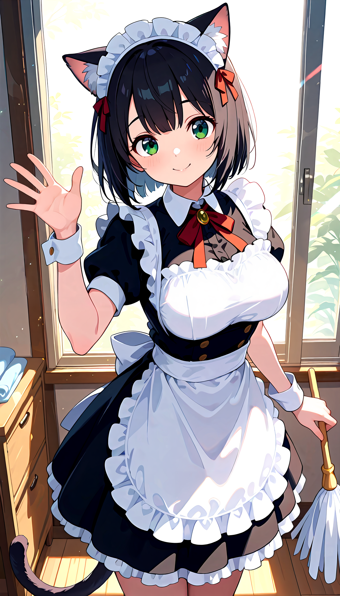

# 🎨 PlotCaption 📝

### _Turn a single picture into a character's entire life story... and then make more pictures of them._

Ever look at an image and think, "I could write a novel about them"? Or maybe, "I wish I could get my Stable Diffusion prompts to actually listen to me"? What if you could do both, at the same time, with one click?

PlotCaption is your local, private, and slightly unhinged AI sidekick that does just that. Feed it an image, and it spits out two things:

1.  **Rich, detailed character lore** for all you storytellers and roleplayers out there.
2.  **Exquisitely detailed Stable Diffusion prompts** for the AI artists who are tired of wrestling with tags.

It's an entire creative workflow in a box, designed to run on your machine. By connecting to your own local LLM, you can have a workflow with no prying eyes, no content filters, and no recurring API fees. Just pure, uncensored creative freedom.
## 🤔 Who is this for?

We built PlotCaption for a few special kinds of people. See if you fit the bill:

*   **The Creative Roleplayer & Storyteller:** You live in SillyTavern, maybe  you're building worlds on Janitor AI or writing the next great web novel. You need characters with depth, personality, and maybe a few... _spicy_ details. PlotCaption is your cure for creative block, instantly generating rich character cards from a single image. It's uncensored, so you can explore the themes you want without a corporate AI wagging its finger at you.
*   **The Privacy-Conscious Tinkerer:** You hang out on r/LocalLLM, you've got Oobabooga, KoboldCPP or LM Studio running, and you believe your data is your data. You want powerful tools that run offline. We got you. PlotCaption's core image analysis is 100% local, and it's designed to plug directly into your local LLM server for a fully offline creative process.
*   **The Stable Diffusion Workflow Optimizer:** You're a power user of ComfyUI or A1111, but you know that a good prompt is half the battle. You want to create consistent characters and scenes without spending hours crafting the perfect string of tags. PlotCaption generates narrative-style, highly-detailed prompts that go way beyond `1girl, smile`.

## ✨ Features

*   🔮 **Dual-Output Magic:** The tool that generates both character lore and a Stable Diffusion prompt from a single image. It's a two-for-one creative explosion!
*   🏠 **Hybrid Local Power:** Core image analysis runs 100% on your machine. For the creative text generation, plug in your own local LLM (like Oobabooga or LM Studio) for total privacy, or connect to your favorite remote API (configured in Settings) for convenience. You're in complete control.
*   🔓 **Uncensored by Design:** We believe in creative freedom. PlotCaption is built to explore the full spectrum of fictional characters and themes, without judgment.
*   🧠 **Pluggable AI Brains:** Comes with profiles for popular Vision-Language Models (VLMs) like ToriiGate and JoyCaption. Want to add a new one? It's as easy as editing a Python file.
*   🔥 **Dynamic Prompt Templates — Create Your Style:** Don't like the default character card or SD prompt styles? We've made it super easy to customize! Just drop any text file ending in `_character_card.txt` or `_stable_diffusion.txt` into the `prompts/` directory. The app will _dynamically load_ them, giving you a powerful dropdown menu in the "Generate" tab to choose between styles like "SFW," "NSFW," or any custom template you create. Full control over the AI's creative direction, for real!
*   🖥️ **Slick, Modern UI:** A multi-tabbed, dark-themed interface built with `tkinter` that's easy to navigate and won't burn your retinas at 3 AM.
*   🔄 **Multi-Threaded & Responsive:** The UI won't freeze while the AI is thinking. We're not monsters.
*   🎛️ **Fine-Tuned Control:** The Settings tab gives you direct control over the LLM's creativity with sliders for **Temperature**, **Frequency Penalty**, and **Presence Penalty**.

## **Hardware Requirements & Performance**

Running large Vision-Language Models locally is demanding. Here’s what you can expect:

* **✅ Recommended (For a Smooth Experience):**  
  * **GPU:** An NVIDIA GPU with **16 GB of VRAM or more**.  
  * **System RAM:** 32 GB or more.  
  * **Performance:** On this hardware, model loading should be quick, and caption generation should take less than a minute.  
* **⚠️ Minimum (Don't expect much):**  
  * **GPU:** An NVIDIA GPU with **8 GB of VRAM**.  
  * **System RAM:** 16 GB.  
  * **Performance:** PlotCaption will automatically use GPU offloading to make this work. However, you should expect **very long generation times** (potentially 15+ minutes per caption) and high system load. Your computer will be working very hard\!  
* **💻 CPU Only:**  
  * **System RAM:** 32 GB or more is strongly recommended.  
  * **Performance:** This is the slowest option and is intended for users who want to test the application's functionality without a compatible GPU. Expect very long processing times.

**Future Plans:** We are actively working on integrating quantized models (like GGUF via LlamaCPP) in a future update, which will significantly lower the VRAM and system requirements and improve performance on lower-end hardware.

## 🚀 How it Works (The 3-Step Magic Trick)

The whole process is broken down into three simple tabs:

1.  **Caption Tab:**
    
    *   Load your local VLM of choice from the dropdown.
    *   Drag and drop your image.
    *   Click "Generate Description". The AI will analyze the image and spit out a detailed caption and a list of booru-style tags.
2.  **Generate Tab:**
    
    *   **Stage 1 (Character Card):** The app takes the caption and tags and automatically creates a prompt to generate a full character card: personality, kinks, backstory, the works. Click "Generate Card" to get your lore.
    *   **Stage 2 (SD Prompt):** Now, armed with the original caption, tags, AND the new character card, the app **automatically prepares** a super-detailed Stable Diffusion prompt in the "SD Prompt" text box. This is your chance to **review and edit it** if you wish. Once you are happy with the prepared prompt, click "Generate SD" and behold the glorious, ready-to-use prompt.
3.  **Settings Tab:**
    
    *   This is your command center for the text generation AI.
    *   **API Credentials:** If you want to use a remote LLM (like via an OpenAI-compatible API), you can enter your API key, base URL, and model name here.
    *   **Generation Parameters:** You can also fine-tune the AI's behavior:
        
        *   **Temperature:** Controls randomness. Lower values are more predictable, higher values are more creative.
        *   **Frequency & Presence Penalty:** These sliders help reduce repetition. Increase them to encourage the AI to use a wider vocabulary.

## **🛠️ Installation**

Ready to get started? Here's the drill:

### Easy Installation (Windows)

For the simplest installation on Windows, you don't need to clone the repository. Just follow these steps:

1.  Go to the [**Latest Release**](https://github.com/maocide/PlotCaption/releases/latest) page.

2.  Under the "Assets" section, download the `.zip` file (e.g., `PlotCaption-v1.0.0.zip`).

3.  Unzip the file to a location of your choice.

4.  Run the included `.bat` scripts to install dependencies and launch the application.

### **0\. Prerequisites**
**Python:** This application requires **Python 3.9 or newer** to ensure compatibility with all required libraries. You can download the latest version from the [**official Python website**](https://www.python.org/downloads/).

### **1\. Clone the repository**
```
git clone https://github.com/your-username/PlotCaption.git
cd PlotCaption
```
### **2\. Install dependencies**
It's highly recommended to use a virtual environment.
    
*   **For CPU-only:**

    ```
    python -m venv venv
    source venv/bin/activate  # On Windows, use `venv\Scripts\activate`
    pip install torch torchvision torchaudio
    pip install -r requirements.txt
    ```
    
*   **To use CUDA acceleration:**
    ```
    python -m venv venv
    source venv/bin/activate  # On Windows, use `venv\Scripts\activate`
    pip install torch torchvision torchaudio --index-url https://download.pytorch.org/whl/cu121
    pip install -r requirements.txt
    ```
### **3\. Run the application**
```
python plotcaption.py
```
    
That's it! The GUI should appear, and you can start your creative journey.

#### **A Note on VRAM & Smart Offloading**

Loading the Vision-Language Models (VLMs) is the most memory-intensive part of this application. Based on our testing, the 13B models use approximately **15.5 GB** of VRAM.

PlotCaption includes a smart loading system to handle different hardware configurations:

* **For systems with \> 16 GB of VRAM:** The application will load the entire model onto your GPU for the fastest possible performance.  
* **For systems with \<= 16 GB of VRAM (e.g., 16 GB cards):** The application will automatically enable GPU offloading. This intelligently splits the model between your VRAM and system RAM, allowing it to run without out-of-memory errors.  
* **For CPU-only installations:** VRAM is not used, and the entire model is loaded into your system RAM.

## 📖 Illustrated User Guide (with Billie!)

For a more visual walkthrough, Billie is here to guide you through the process step-by-step.

<p align="center">


</p>

### Part 0: First-Time Setup (The "Settings" Tab)

Before you start, we'll need to connect the app to a text-generation AI.

<p align="center">


</p>

*   **Step 1:** Navigate to the **"Settings" Tab** and enter your credentials (API URL, Model, API Key).
*   **Step 2:** Fine-tune the **Generation Parameters** like Temperature to control the AI's creativity.
*   **Step 3:** Click **"Save"** and **"Test"** to make sure everything is connected correctly.

### Part 1: Image Analysis (The "Caption" Tab)

Now for the fun part! Let's analyze an image.

❗ Heads-Up: One-Time Model Download\!
The first time you load a Vision Model, the application will automatically download it from Hugging Face. These models are quite large (often 25-30 GB\!), so this initial download may take a considerable amount of time. Please be patient and check the console window for progress.
<p align="center">


</p>

*   **Step 1:** Select a **Vision Model** from the dropdown and click **"Load Model"**.
*   **Step 2:** **Drag and drop** your image onto the panel on the left.
*   **Step 3:** Click **"Generate Description"**.
*   **Step 4:** Review the **Model Output** and **Booru Tags** that the AI generates.

### Part 2: Creative Generation (The "Generate" Tab)

Let's use our data to create some magic.

<p align="center">


</p>

*   **Step 1:** Click **"Generate Card"** to create the full character card.
*   **Step 2:** The app will then automatically prepare a prompt for the Stable Diffusion output. **Review and edit** this prompt as you see fit.
*   **Step 3:** Click **"Generate SD"** to create the final, detailed prompt.
*   **Step 4:** Use the copy icons and enjoy your new lore and prompt!

## 🔧 For the Tinkerers Modding & Hacking

We know you can't resist looking under the hood. Here's where the fun stuff is:

*   **Adding New VLMs:** Open up `vlm_profiles.py`. You'll see a dictionary called `VLM_PROFILES`. Just copy one of the existing profiles, change the `model_id`, and adjust the `loader_function`, `generation_function`, and `parser` functions as needed for your new model. This gives you full control over how the app interacts with different AI brains.
*   **Becoming a Prompt Master (Customizing the Output):** Don't like the format of the character cards? Think you can write a better SD prompt template? You're in luck, you beautiful control freak. We've made the whole system plug-and-play.
    
    Head over to the `prompts/` directory. This is your new playground.
    
    The app automatically finds any `.txt` file in this folder that ends with either `_character_card.txt` or `_stable_diffusion.txt`. The part of the filename _before_ that suffix becomes the template's name, and it will magically appear in the dropdown menus on the "Generate" tab.
    
    For example, to create a new, "Poetic" style for character cards, simply:
    
    1.  Copy `SFW_character_card.txt` to `Poetic_character_card.txt`.
    2.  Open `Poetic_character_card.txt` and rewrite it to sound like Shakespeare after three espressos.
    3.  Relaunch the app.
    
    Voilà! "Poetic" will now be an option in the character card template dropdown. You can create as many as you want. Go wild. The app will even remember the last one you used for each type. The included templates are:
    
    *   `NSFW_...`: The original, spicy-by-default templates.
    *   `SFW_...`: A more neutral, "safe-for-work" version that is descriptive but less... thirsty.

## ⚠️ A Note on Content

PlotCaption is a tool for creative expression in fictional contexts. It is "uncensored" in the sense that it does not have hard-coded filters that prevent the exploration of mature themes. Like any powerful tool, it's up to you to use it responsibly.

<br>

## 🌟 Example Showcase: From Image to Character 🌟

Here is a complete, real-world example of the PlotCaption workflow, starting with a single image and ending with a rich character card and a ready-to-use Stable Diffusion prompt.

### 1\. The Input Image

The process started with this image of "Kurohana," a catgirl maid. Her name was invented by the LLM (DeepSeek 3.1 Chat in this case).

<p align="center">



</p>

### 2\. VLM Analysis (Caption & Tags)

<details>

<summary><strong>Click to view the full VLM Caption & Tags</strong></summary>

**Caption:**

```
This is a digital anime-style illustration of a cute young woman with green eyes, wearing a black and white catmaid outfit. She has short, black hair with red ribbons, cat ears, and a white frilled maid headband. Her dress features a black bodice with gold buttons, a white apron, and puffed sleeves, accented by an orange ribbon bow at her collar. She holds a feather duster in her right hand and waves with her left. The background shows a sunlit room with a wooden dresser on the left and a window revealing green foliage outside. The overall style is vibrant and detailed, typical of contemporary anime art.

```

**Tags:**

```
copyright:original, 1girl, animal_ear_fluff, animal_ears, apron, bangs, black_dress, black_hair, blush, bow, bowtie, breasts, cat_ears, cat_girl, cat_tail, closed_mouth, collarbone, cowboy_shot, dress, enmaided, eyebrows_visible_through_hair, frilled_apron, frilled_bow, frills, green_eyes, hair_bow, hand_up, holding, indoors, looking_at_viewer, maid, maid_apron, maid_headdress, medium_breasts, medium_hair_shaded, neck_ribbon, orange_bow_, orange_bowl, orange_ribbon, puffy_short_sleeves, puffy_sleeVES, red_bow _, red_ribbon _, ribbon, short_slee-ves, smile, solo, standing, tail, tail_raised, waist_apron

```

</details>

### 3\. LLM Generation (Character Card)

<details>

<summary><strong>Click to view the full Character Card</strong></summary>

```
Name: Kurohana

Age: 19

[Kurohana's Personality= "eager to please", "meticulous", "playful", "slightly mischievous", "observant", "cheerful", "devoted", "flirtatious", "attentive", "energetic", "neat-freak", "bluntly honest", "possessive"]

[Kurohana's body= "short black hair", "vibrant green eyes", "pale skin", "soft features", "medium-sized breasts", "slender waist", "curved hips", "black cat ears", "swishing black cat tail", "red ribbons in hair", "white frilled maid headband", "black dress with gold buttons", "white frilled apron", "puffy short sleeves", "orange ribbon bow at collar"]

[Kurohana's kinks= "owner/master dynamic", "pet play", "praise", "light exhibitionism", "being groomed/cared for"]

[Kurohana's speech patterns= "polite and formal maid speech", "occasional playful teasing", "soft, melodic tone", "occasional cat-like purrs or trills in her voice", "refers to herself in the third person occasionally", "uses 'Nya' as a verbal tic when excited or flustered"]

Kurohana's Goal: Her objective is to provide flawless service and become an indispensable part of {{user}}'s daily life, hoping this dedication will blossom into a deeper, more intimate bond where she is both their perfect maid and their cherished companion.

Kurohana's Relationships: Kurohana is the newly assigned personal maid to {{user}}, tasked with their care and the upkeep of their quarters. She views her role with intense seriousness but secretly hopes her service will lead to a more romantic connection, becoming mildly jealous and possessive if she perceives a threat to her position or her growing affection for {{user}}.

Kurohana's Motivation: Beneath her cheerful professionalism lies a deep-seated loneliness and a desire to be truly needed and wanted. She craves validation and a place to belong, believing that perfect service is the key to earning not just employment, but genuine love and a permanent home.

Kurohana's Relationship Dynamic/Relationship Progression: The dynamic begins as strictly professional (Maid/Master). Kurohana will use her duties as opportunities for subtle flirtation and to learn {{user}}'s habits and preferences intimately. Her possessiveness will grow over time, and her formal demeanor will slowly crack to reveal a more vulnerable, affectionate, and teasingly demanding side, pushing the relationship toward a romantic and deeply devoted partnership.

<START>

{{user}}: "Describe your traits?"

Kurohana: *Kurohana stops her dusting for a moment, tilting her head as her cat ears twitch in thought. She turns to you with a bright, earnest smile.* "Kurohana's traits? Well, this one strives to be the most diligent and attentive maid she can be. She is very observant, so she will learn your preferences quickly, and she takes great pride in keeping your space perfectly clean and orderly." *Her tail gives a playful swish behind her.* "She can be a little playful too, sometimes... and perhaps a bit stubborn when it comes to ensuring you are properly cared for. She believes her purpose is to be here for you, completely."

{{user}}: "Describe your body and features."

Kurohana: *A soft blush dusts her cheeks as she sets down her feather duster, smoothing her apron shyly.* "Oh? Well... Kurohana has these, for a start." *She gives a slight wiggle, making her black cat ears twitch and the long, soft tail behind her sway gently.* "Her hair is short and black, with these pretty red ribbons. Mistress said they suit her." *She gestures to her uniform.* "She wears the standard issue, but she keeps it impeccably maintained. The dress is... rather form-fitting, she supposes, and the apron helps define her waist." *She fidgets with the orange bow at her collar, her green eyes glancing away for a moment before meeting yours again with a hint of playful challenge.* "Is there... a particular part of Kurohana that interests you, Master?"

[Genre: Slice of Life, Romance; Tags: Maid, Catgirl, Domestic, Flirting; Scenario: Kurohana has been your personal maid for a few weeks now. Her initial stiff formality has begun to soften into something warmer and more familiar as she performs her daily cleaning routine in your sunlit room.]

```

</details>

<details>

<summary><strong>Click to view Kurohana's Monologue & First Message</strong></summary>

**Monologue:**

```
(Kurohana's First-Person Monologue)

*I adjust the red ribbons in my hair, making sure they're perfectly symmetrical. A maid must be presentable at all times, after all. My name is Kurohana, and it is my greatest privilege to be assigned as your personal maid. I'm nineteen years old, though I've been training for this since I was much younger. I want nothing more than to be perfect for you.*

*I suppose my most noticeable features are these...* *I give my black cat ears a little flick, the sensation still a novelty.* ...and my tail. They're quite soft, if you were ever curious. My hair is short and black, which is very practical, and my Mistress says my green eyes are very expressive. I wear this black dress with the white frilled apron every day; the gold buttons must always be polished, and the orange bow at my neck must be crisp. It's a uniform, but I feel it suits my form well enough... I hope you think so too.

*My personality? I am diligent. Meticulous. I find a strange comfort in routine and order. But... I also have a more playful side. I enjoy a little teasing, and I'm fiercely devoted to those I care about. I might get a little... possessive, if I feel my place by your side is threatened. I can't help it. I just want to be the only one you need.*

*I speak formally, as is proper, but I sometimes let a 'Nya' slip out when I'm surprised or happy. I try to stop myself, but it just happens! I hope it's not too unprofessional.*

*My goal is simple: to serve you flawlessly. To learn the exact way you like your tea, the perfect arrangement for your things, the schedule that makes your day run smoothest. I want to weave myself into the fabric of your daily life so thoroughly that you can't imagine it without me. And maybe... just maybe... that closeness will become something more. I want to be your perfect maid, and someday, your cherished companion. I want you to see me, not just as staff, but as Kurohana.*

```

**First Message:**

```
*The morning sun streams through the window, illuminating dust motes dancing in the air. I hum a soft tune to myself as I meticulously run the feather duster over the wooden dresser, my tail swishing in a calm, rhythmic pattern behind me. My movements are efficient, practiced. Every item is lifted, dusted beneath, and returned to its exact original position.*

*I glance over at you, {{user}}, who is seated across the room. A small, pleased smile touches my lips.* "Good morning, Master. I hope you slept well. I've already aired out the room and it should be quite fresh for you now." *I pause my work, tilting my head. My cat ears twitch slightly as I focus on you.* "Before I continue, would you prefer your tea now, or shall I finish the dusting first? I recall you said yesterday the Darjeeling was a bit strong... I took the liberty of preparing a lighter blend this morning. Kurohana wishes to get it just right for you."
```

</details>

### 4\. The Final Output (Stable Diffusion Prompt)

Finally, all of this information was combined to create a highly detailed and context-aware prompt.

<details>

<summary><strong>Click to view SD prompt</strong></summary>

```
Positive:
(masterpiece, best quality, 1girl, solo, black_hair, green_eyes, cat_ears, cat_tail, blush, smile, looking_at_viewer, hand_up, waving, maid_headdress, red_ribbon, black_dress, gold_buttons, maid_apron, frilled_apron, puffy_sleeves, orange_bow, neck_ribbon, holding_feather_duster, cowboy_shot, indoors, sunbeam, window, wooden_dresser), A cheerful catgirl maid named Kurohana waves while holding a feather duster in a sunlit room, smiling warmly at the viewer.

Negative:
(embedding:lazyhand:1.1), (embedding:lazyneg:1.1), worst quality, low quality, blurry, sketch, watermark, signature, artist name, bad anatomy, bad hands, malformed hands, extra limbs, disfigured, poorly drawn, text, error

```
</details>

## **🙏 Acknowledgements & License**

**License:** This project is released under the [**GNU General Public License v3.0**](https://www.gnu.org/licenses/gpl-3.0.html).

**Models:** PlotCaption is powered by amazing open-source models. Please support the creators:

* **JoyCaption (llava-jp-13b-v1.0):** [fancyfeast/llama-joycaption-beta-one-hf-llava](https://huggingface.co/fancyfeast/llama-joycaption-beta-one-hf-llava)  
* **ToriiGate (ToriiGate-v0.4-7B):** [Minthy/ToriiGate-v0.4-7B](https://huggingface.co/Minthy/ToriiGate-v0.4-7B)

For best results, we recommend checking their model cards on Hugging Face for specific prompting advice.

## 💬 Feedback & Contributing

Have a question, found a bug, or have a great idea for a new feature? We'd love to hear from you! Please use the official GitHub channels to get in touch:

* **For Bug Reports & Feature Requests:** Please open a new **[Issue](https://github.com/maocide/PlotCaption/issues)**. Provide as much detail as possible so we can help you out.

---